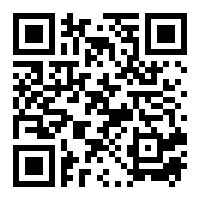

# Inform and Connect

Inform and connect is a simple web site where important information from multiple govermental institutions is gathered. The information is further translated into the language of choise so that even people that do not speak Sweidish are well imformed.

Inform and Connect was born as a part of [hackTheCrisis](https://www.hackthecrisis.se/) hackathon (3-5 of Arpril 2020)

UX design by [Maija Perfiljeva](github.com/mperfiljeva), see UX workspace [here](https://whimsical.com/SbvkKwSRyFnfmW6SM31Zu6) and final desing [here](https://www.figma.com/file/ZISP92E0mYkAtkAB7f6tkm/Connect-and-inform?node-id=0%3A1).

## Team members:

- Maija Perfiljeva: UX and UI design, [github.com/mperfiljeva](mperfiljeva)
- Ying Cheng: Team managment, www.arkus.ai
- Venkata Sai Teja Mogillapalle: Technical support, [github.com/sai36](www.github.com/sai36)
- Vladimir Li: Full-stack development and integration, [github.com/VladimirLi](www.github.com/VladimirLi)

## Link and QR code to current instance:

[inform-and-connect.web.app](https://inform-and-connect.web.app)
